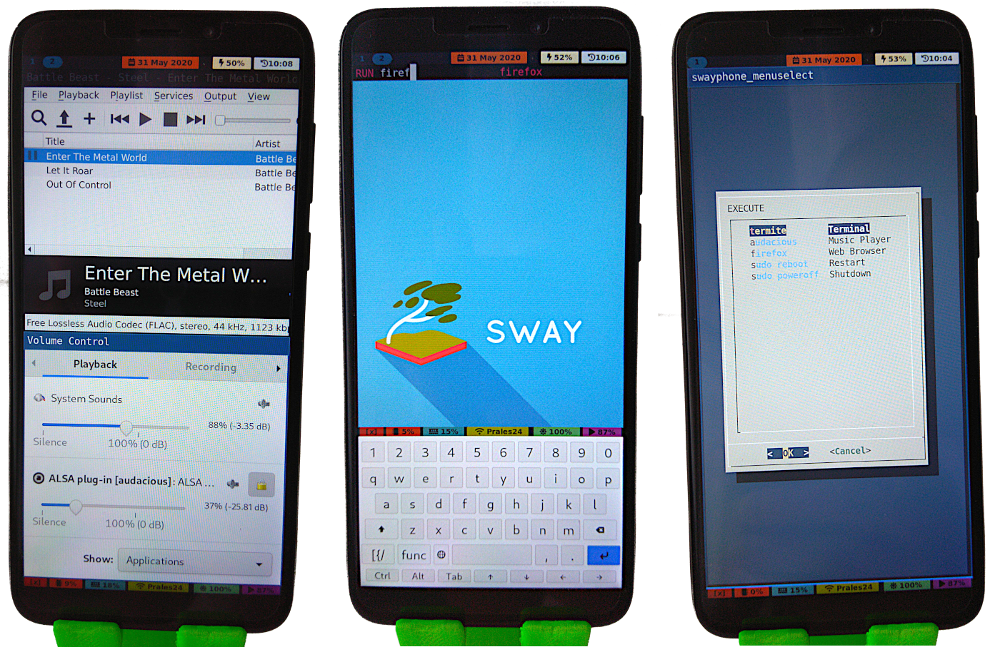

# pinephone-sway-poc
Sway UI configured for PINE64 PinePhone (Proof Of Concept)

You can find ready-made config files and installation instructions on how to set up Sway on postmarketOS and use it with a PinePhone.



## Install
Start with a [postmarketOS](https://wiki.postmarketos.org/wiki/PINE64_PinePhone_(pine64-pinephone)) for PinePhone image with `postmarketos-ui-sway` installed. Either use the pre-built demo image or build a custom one with `pmbootstrap`.

Flash the system onto the phone (either to an SD card or directly to the eMMC with Jumpdrive).

Open a terminal on the phone (either through SSH, the serial connection or directly on the screen) and run this:
```
# components
$ sudo apk add waybar bemenu swaylock swayidle networkmanager htop pavucontrol

# build tools
$ sudo apk add git make meson ninja

# installation
$ git clone --recurse-submodules https://github.com/Dejvino/pinephone-sway-poc
$ cd pinephone-sway-poc
$ make install_user
$ sudo make install_system
```

That's it. You should now have everything in place. Reboot to use the new settings.

## Usage

**TODO: this.**


## Components
* postmarketOS - base Linux distribution (though any other would work as well)
* sway (pmos package) - tiling Wayland compositor
* * swayidle, swaylock - utils for sway
* bemenu (pmos package) - app launcher
* waybar (pmos package) - Wayland status bar
* * [carlosdss22/dotfiles](https://github.com/carlosdss22/dotfiles/tree/master/waybar) - styles used
* squeekboard (pmos package) - on-screen keyboard for Wayland
* * [terminal.yaml](https://source.puri.sm/btantau/squeekboard/blob/btantau-master-patch-76686/data/keyboards/terminal.yaml) - keyboard layout based on this improved version
* [pinephone-toolkit](https://github.com/Dejvino/pinephone-toolkit) - various utilities for the PinePhone
* [sxmo-lisgd](https://git.sr.ht/~mil/lisgd) - gesture detection daemon
* htop (pmos package) - Processes monitoring
* pavucontrol (pmos package) - PulseAudio control panel

(*pmos package* = available as a package directly from the postmarketOS repository)

